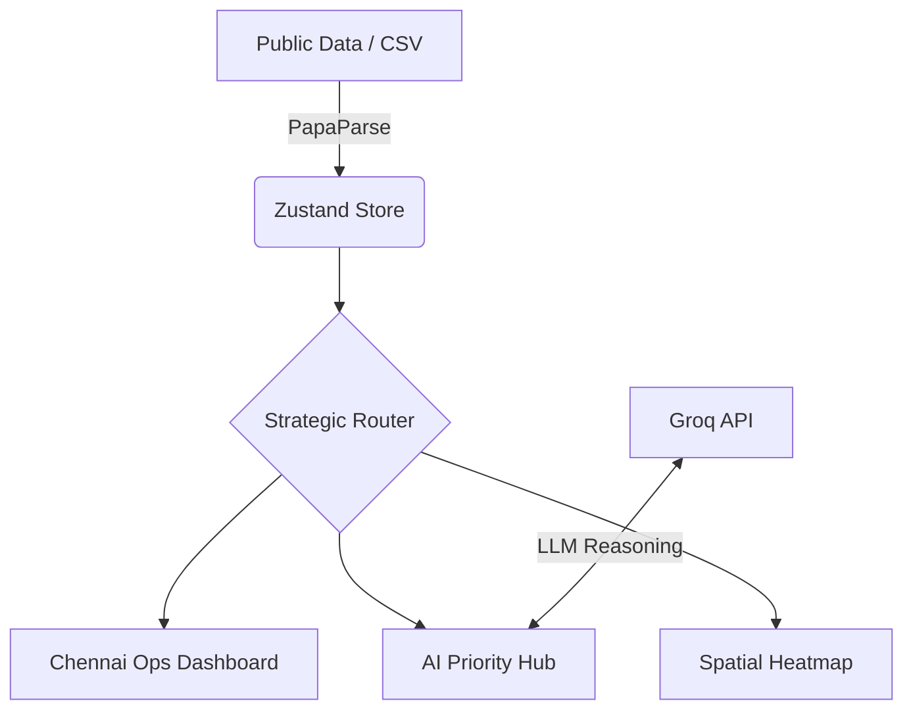

# 🏙️ UrbanResponse.AI


> **"Redefining Urban Resilience through Intelligent Telemetry & AI-Driven Response."**

[](https://nextjs.org/)
[](https://tailwindcss.com/)
[](https://www.framer.com/motion/)
[](https://groq.com/)

---

## 🌟 The Vision

**UrbanResponse.AI** is a futuristic, holographic command center designed for the City of Chennai. It transforms raw infrastructure data into actionable strategic insights, enabling rapid response to urban decay, traffic congestion, and critical utility failures.

Built with a **Cyber-Premium aesthetic**, the platform utilizes real-time telemetry and advanced LLM reasoning (powered by Groq) to prioritize incidents and allocate resources where they are needed most.

---

## 🚀 Core Pillars

### 📊 Strategic Command Dashboard
A high-fidelity interface providing granular visibility into:
- **Infrastructure Sectors**: Bridges, Roadways, Drainage, Pipelines, and Lighting.
- **Real-time Telemetry**: Active response status and health metrics.
- **Global Status Monitoring**: System-wide scans with immediate alert capabilities.

### 🧬 AI-Driven Prioritization
Leveraging **Groq's LPU™ technology**, UrbanResponse.AI autonomously evaluates incident gravity based on:
- Population density impact.
- Cascading failure risks.
- Fleet proximity and response time.

### 🗺️ Geospatial Intelligence
Interactive **Heatmaps** and **Spatial Risk Overlays** visualize the city's pulse, highlighting critical zones and allowing for predictive maintenance.

---

## 🛠️ Tech Architecture



---

## ⚙️ Getting Started

### Prerequisites
- Node.js 18+
- Groq API Key (for intelligent insights)

### Installation
1. **Clone the repository**:
   ```bash
   git clone https://github.com/shagyeeen/UrbanResponse.AI.git
   cd urban-response-ai
   ```

2. **Install dependencies**:
   ```bash
   npm install
   ```

3. **Configure Environment**:
   Create a `.env.local` file in the root directory:
   ```env
   GROQ_API_KEY=your_actual_key_here
   ```

4. **Launch the Engine**:
   ```bash
   npm run dev
   ```

Open [http://localhost:3000](http://localhost:3000) to enter the command center.

---

## 🛣️ Roadmap

- [ ] **Phase 1**: Real-time Sensor Integration (IoT).
- [ ] **Phase 2**: Mobile Response App for Field Units.
- [ ] **Phase 3**: Predictive Crisis Simulation Engine.
- [ ] **Phase 4**: Multi-City Support for Global Urban Mobility.

---

## 🛡️ Security & Compliance

UrbanResponse.AI is designed with **Privacy-First** principles. All infrastructure telemetry is handled securely, ensuring city data remains protected while enabling efficient public service delivery.

---

<p align="center">
  Developed with ❤️ for the Future of Chennai.
</p>
